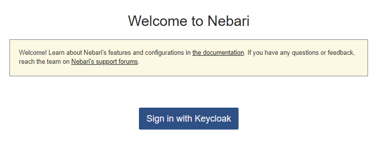
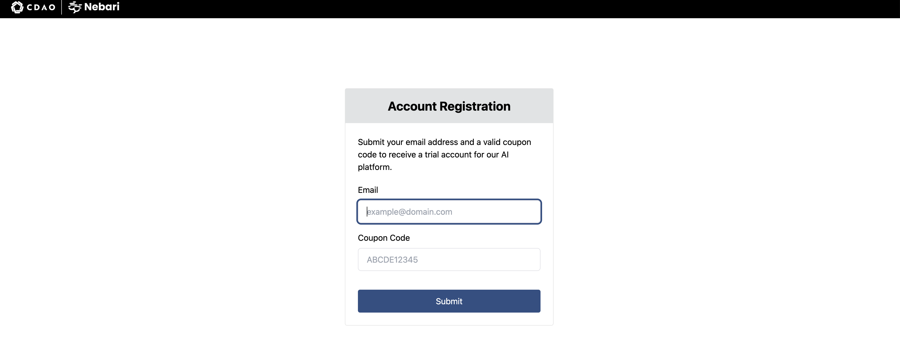
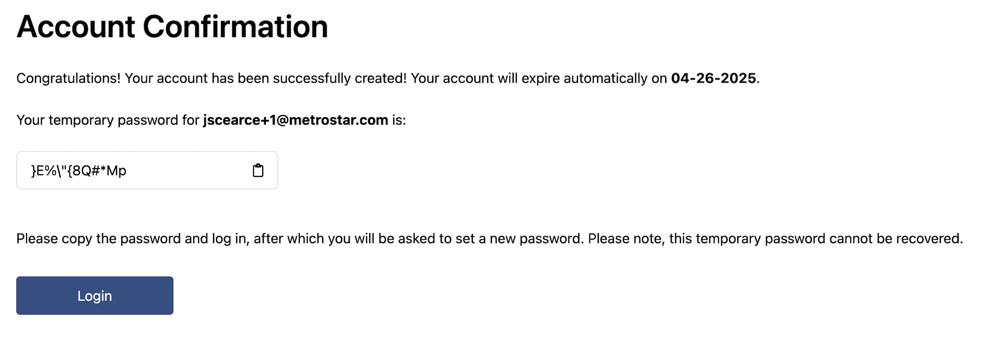
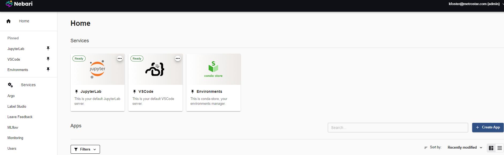

# Nebari Plugin Self Registration

[](https://pypi.org/project/nebari-plugin-self-registration)
[](https://pypi.org/project/nebari-plugin-self-registration)

---

**Table of Contents**

- [Installation](#installation)
- [License](#license)

## Installation

```console
pip install nebari-plugin-self-registration
```

## Running locally with Docker

_Note_: running locally requires a `config.yaml` file to be present within the `self-registration` directory. Please create a copy of the `sample.config.yaml`, rename, and update as needed before proceeding:

1. Navigate to the `self-registration` directory
2. To build the docker image, run the following:

```
docker build . --file Dockerfile.local -t self-registration
```

3. To run the app, run the following:

```
docker run -p 8000:8000 --name self-registration self-registration
```

4. Navigate to http://0.0.0.0:8000/registration

## User Registration via this extension

Steps for self registration:

- Navigate to your Nebari domain.
<p align="center">
  
</p>

- You may have a hyperlink on the welcome page that takes you to the user registration form. If not, navigate to https://{your-domain-name}/registration

<p align="center">
  
</p>

- Enter your email address and coupon code.

- After clicking "Submit" follow the instructions to login with your temporary password. By clicking the "Login" button, it will take you to a Welcome page where you can sign in with Keycloak.

- After you have entered a new password, you will receive a verification email.

<p align="center">
  
</p>

- Once your email is verified and you login you will see the Nebari landing page.

<p align="center">
  
</p>

## License

`nebari-plugin-self-registration` is distributed under the terms of the [Apache](./LICENSE.md) license.
