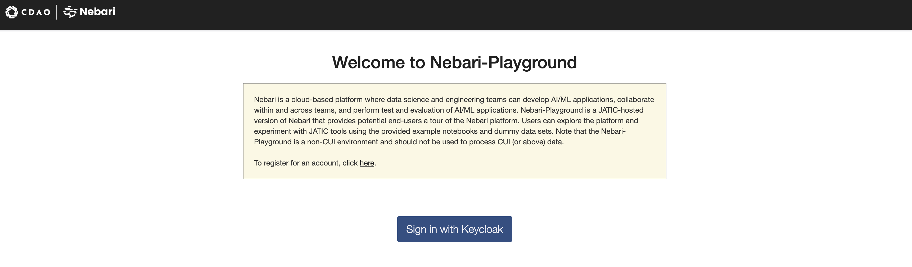
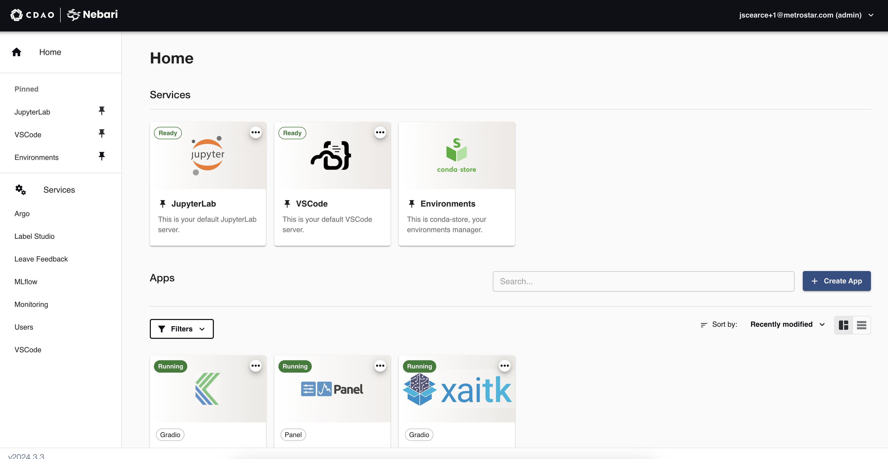

# Nebari Plugin Self Registration

[](https://pypi.org/project/nebari-plugin-self-registration)
[](https://pypi.org/project/nebari-plugin-self-registration)

-----

**Table of Contents**

- [Installation](#installation)
- [License](#license)

## Installation

```console
pip install nebari-plugin-self-registration
```

## User Registration
How to register for the playground:

- Navigate to [https://playground.jatic.net/](https://playground.jatic.net/)
<p align="center">
  
</p>

- Click the link at "To register for an account, click here." or go to [https://playground.jatic.net/registration](https://playground.jatic.net/registration)

<p align="center">
  
</p>

- Enter your email address and coupon code.  Note that your email address must be on one of these domains:
  - quansight.com
  - metrostar.com
  - mail.mil
  - us.navy.mil
  - us.af.mil
  - army.mil
  - va.gov
  - hssedi.dhs.gov
  - ll.mit.edu
  - sei.cmu.edu
  - mitre.org
  - kitware.com
  - ariacoustics.com
  - ibm.com
  - nyla.io
  - morsecorp.com
  - lanl.gov
  - caci.com

- After clicking "Submit" follow the instructions to login with your temporary password. By clicking the "Login" button, it will take you to a Welcome page where you can sign in with Keycloak.

<p align="center">
  
</p>

- After you have entered a new password, you will receive an email from "donotreply@jatic.net".  Follow the verification instructions and you will be taken to the playground.

<p align="center">
  
</p>

- Once your email is verified and you login you should see the Nebari landing page.

<p align="center">
  
</p>

## License

`nebari-plugin-self-registration` is distributed under the terms of the [Apache](./LICENSE.md) license.
